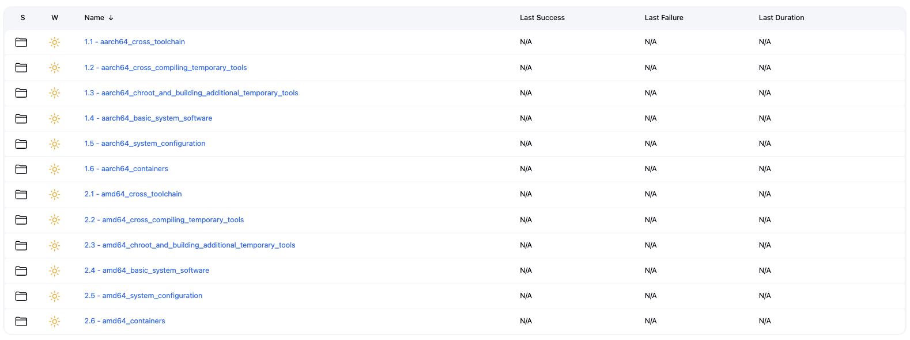

# Generic distro toolkit for GNU/Linux operating system

[](https://opensource.org/licenses/Apache-2.0)

## Project Overview

I’m building GNU/Linux following LFS (Linux From Scratch) with Ansible and Jenkins. This project is a general-purpose framework for building Linux distributions in a semi-automated and DevOps way.

gdt (Generic Distro Toolkit) is a work-in-progress.

### LFS Numbered Job Jenkins

The operating system can be built by following Jenkins numbered builds.

NOTE: When you are on aarch64_basic_system_software and reboot the aarch64 build node, remember to launch 0001 - Changing Ownership and Preparing Virtual Kernel File Systems (Chroot and Building Additional Temporary Tools) or ensure that the virtual systems are mounted.

TODO: Automate this process at the boot of the aarch64 build node if a successful provision has already been made and the machine has been restarted.

```bash
        if ! mountpoint -q $LFS/dev; then
          sudo mount -v --bind /dev $LFS/dev
        fi

        if ! mountpoint -q $LFS/dev/pts; then
          sudo mount -vt devpts devpts -o gid=5,mode=0620 $LFS/dev/pts
        fi

        if ! mountpoint -q $LFS/proc; then
          sudo mount -vt proc proc $LFS/proc
        fi

        if ! mountpoint -q $LFS/sys; then
          sudo mount -vt sysfs sysfs $LFS/sys
        fi

        if ! mountpoint -q $LFS/run; then
          sudo mount -vt tmpfs tmpfs $LFS/run
        fi    
```

```bash
aarch64_cross_toolchain - amd64_cross_toolchain
 └─0001 - Binutils Pass 1     (Cross Toolchain)
 └─0002 - GCC Pass 1          (Cross Toolchain)
 └─0003 - Linux API Headers   (Cross Toolchain)
 └─0004 - Glibc               (Cross Toolchain)
 └─0005 - Libstdc++ from GCC  (Cross Toolchain)

aarch64_cross_compiling_temporary_tools - amd64_cross_compiling_temporary_tools
 └─0001 - M4              (Cross Compiling Temporary Tools)
 └─0002 - Ncurses         (Cross Compiling Temporary Tools)
 └─0003 - Bash            (Cross Compiling Temporary Tools)
 └─0004 - Coreutils       (Cross Compiling Temporary Tools)
 └─0005 - Diffutils       (Cross Compiling Temporary Tools)
 └─0006 - File            (Cross Compiling Temporary Tools)
 └─0007 - Findutils       (Cross Compiling Temporary Tools)
 └─0008 - Gawk            (Cross Compiling Temporary Tools)
 └─0009 - Grep            (Cross Compiling Temporary Tools)
 └─0010 - Gzip            (Cross Compiling Temporary Tools)
 └─0011 - Make            (Cross Compiling Temporary Tools)
 └─0012 - Patch           (Cross Compiling Temporary Tools)
 └─0013 - Sed             (Cross Compiling Temporary Tools)
 └─0014 - Tar             (Cross Compiling Temporary Tools)
 └─0015 - Xz              (Cross Compiling Temporary Tools)
 └─0016 - Binutils        (Cross Compiling Temporary Tools)
 └─0017 - GCC Pass 2      (Cross Compiling Temporary Tools)

aarch64_chroot_and_building_additional_temporary_tools - amd64_chroot_and_building_additional_temporary_tools
 └─0001 - Changing Ownership and Preparing Virtual Kernel File Systems (Chroot and Building Additional Temporary Tools)
 └─0002 - Gettext                                                      (Chroot and Building Additional Temporary Tools)
 └─0003 - Bison                                                        (Chroot and Building Additional Temporary Tools)
 └─0004 - Perl                                                         (Chroot and Building Additional Temporary Tools)
 └─0005 - Python                                                       (Chroot and Building Additional Temporary Tools)
 └─0006 - Texinfo                                                      (Chroot and Building Additional Temporary Tools)
 └─0007 - Util-linux                                                   (Chroot and Building Additional Temporary Tools)
 └─0008 - Cleaning up and Saving the Temporary System                  (Chroot and Building Additional Temporary Tools)

aarch64_basic_system_software - amd64_basic_system_software
 └─0001 - Man-pages         (Basic System Software)
 └─0002 - Iana-Etc          (Basic System Software)
 └─0003 - Glibc             (Basic System Software)
 └─0004 - Zlib              (Basic System Software)
 └─0005 - Bzip2             (Basic System Software)
 └─0006 - Xz                (Basic System Software)
 └─0007 - Lz4               (Basic System Software)
 └─0008 - Zstd              (Basic System Software)
 └─0009 - File              (Basic System Software)
 └─0010 - Readline          (Basic System Software)
 └─0011 - M4                (Basic System Software)
 └─0012 - Bc                (Basic System Software)
 └─0013 - Flex              (Basic System Software)
 └─0014 - Tcl               (Basic System Software)
 └─0015 - Expect            (Basic System Software)
 └─0016 - DejaGNU           (Basic System Software)
 └─0017 - Pkgconf           (Basic System Software)
 └─0017A - pkg-config       (Basic System Software)
 └─0018 - Binutils          (Basic System Software)
 └─0019 - GMP               (Basic System Software)
 └─0020 - MPFR              (Basic System Software)
 └─0021 - MPC               (Basic System Software)
 └─0022 - Attr              (Basic System Software)
 └─0023 - Acl               (Basic System Software)
 └─0024 - Libcap            (Basic System Software)
 └─0025 - Libxcrypt-4.4.38  (Basic System Software)
 └─0026 - Shadow            (Basic System Software)
 └─0027 - GCC               (Basic System Software)
 └─0028 - Ncurses           (Basic System Software)
 └─0029 - Sed               (Basic System Software)
 └─0030 - Psmisc            (Basic System Software)
 └─0031 - Gettext           (Basic System Software)
 └─0032 - Bison             (Basic System Software)
 └─0033 - Grep              (Basic System Software)
 └─0034 - Bash-5.2.37       (Basic System Software)
 └─0035 - Libtool           (Basic System Software)
 └─0036 - GDBM              (Basic System Software)
 └─0037 - Gperf             (Basic System Software)
 └─0038 - Expat             (Basic System Software)
 └─0039 - Inetutils         (Basic System Software)
 └─0040 - Less              (Basic System Software)
 └─0041 - Perl              (Basic System Software)
 └─0042 - XML Parser        (Basic System Software)
 └─0043 - Intltool          (Basic System Software)
 └─0044 - Autoconf          (Basic System Software)
 └─0045 - Automake          (Basic System Software)
 └─0046 - OpenSSL           (Basic System Software)
 └─0047 - Libelf            (Basic System Software)
 └─0048 - Libffi            (Basic System Software)
 └─0049 - Python            (Basic System Software)
 └─0050 - Flit-Core         (Basic System Software)
 └─0051 - Wheel             (Basic System Software)
 └─0052 - Setuptools        (Basic System Software)
 └─0053 - Ninja             (Basic System Software)
 └─0054 - Meson             (Basic System Software)
 └─0055 - Kmod              (Basic System Software)
 └─0056 - Coreutils         (Basic System Software)
 └─0057 - Check             (Basic System Software)
 └─0058 - Diffutils         (Basic System Software)
 └─0059 - Gawk              (Basic System Software)
 └─0060 - Findutils         (Basic System Software)
 └─0061 - Groff             (Basic System Software)
 └─0062 - GRUB              (Basic System Software)
 └─0063 - Gzip              (Basic System Software)
 └─0064 - IPRoute2          (Basic System Software)
 └─0065 - Kbd               (Basic System Software)
 └─0066 - Libpipeline       (Basic System Software)
 └─0067 - Make              (Basic System Software)
 └─0068 - Patch             (Basic System Software)
 └─0069 - Tar               (Basic System Software)
 └─0070 - Texinfo           (Basic System Software)
 └─0071 - Vim               (Basic System Software)
 └─0072 - MarkupSafe        (Basic System Software)
 └─0073 - Jinja2            (Basic System Software)
 └─0074 - Udev from Systemd (Basic System Software)
 └─0075 - Man-DB            (Basic System Software)
 └─0076 - Procps-ng         (Basic System Software)
 └─0077 - Util-linux        (Basic System Software)
 └─0078 - E2fsprogs         (Basic System Software)
 └─0079 - Sysklogd          (Basic System Software)
 └─0080 - SysVinit          (Basic System Software)
 └─0081 - openssh           (Basic System Software)
 └─0082 - Stripping         (Basic System Software)
 └─0083 - Cleaning Up       (Basic System Software)
 └─0084 - libgcrypt         (Basic System Software) OPTIONAL
 └─0085 - OPTIONALlibksba   (Basic System Software) OPTIONAL
 └─0086 - npth              (Basic System Software) OPTIONAL
 └─0087 - libgpg-error      (Basic System Software) OPTIONAL
 └─0088 - gpgme             (Basic System Software) OPTIONAL
 └─0089 - libassuan         (Basic System Software) OPTIONAL
 └─0090 - gnupg             (Basic System Software) OPTIONAL
 └─0091 - glib              (Basic System Software) OPTIONAL
 └─0092 - GO                (Basic System Software) OPTIONAL
 └─0093 - conmon            (Basic System Software) OPTIONAL
 └─0094 - libpsl            (Basic System Software) OPTIONAL
 └─0095 - libidn2           (Basic System Software) OPTIONAL
 └─0096 - libunistring      (Basic System Software) OPTIONAL
 └─0097 - curl              (Basic System Software) OPTIONAL
 └─0098 - asciidoc          (Basic System Software) OPTIONAL
 └─0099 - libxslt           (Basic System Software) OPTIONAL
 └─0100 - libxml2           (Basic System Software) OPTIONAL
 └─0101 - icu4c             (Basic System Software) OPTIONAL
 └─0102 - git               (Basic System Software) OPTIONAL
 └─0103 - libseccomp        (Basic System Software) OPTIONAL
 └─0104 - libtasn1          (Basic System Software) OPTIONAL
 └─0105 - p11-kit           (Basic System Software) OPTIONAL
 └─0106 - make-ca           (Basic System Software) OPTIONAL
 └─0107 - iptables          (Basic System Software) OPTIONAL
 └─0108 - cpio              (Basic System Software) OPTIONAL

aarch64_system_configuration - amd64_system_configuration
 └─0001 - LFS-Bootscripts                      (System Configuration)
 └─0002 - BLFS-bootscripts-IPTABLES OPTIONAL   (System Configuration)
 └─0003 - Linux                                (System Configuration)
 └─0004 - Prepare System Image                 (System Configuration)

aarch64_containers - amd64_containers
 └─0001 - runc             (Containers)
 └─0002 - cri-o            (Containers)
 └─0003 - etcd             (Containers)
 └─0004 - kubernetes       (Containers)
 └─0005 - kubernetes-setup (Containers)
```

#### LFS Numbered Folders (follow the order)

Ensure you follow the sequence of numbered folders during the LFS build process. Each folder corresponds to a specific step, and skipping or rearranging them may lead to errors or inconsistencies in the build.




### Step 0 - Install required tools

#### LFS Build Server

* Jenkins
* Redmine
* Enable KVM
* Libvirt, QEMU
* Cockpit
* Redmine (if you want track your progress)


#### LFS Build Node aarch64

**Launch export JENKINS_AGENT_SECRET=xxx before vagrant provision**
**Launch export JENKINS_DOWNLOAD_LFS_ARCHIVES=true if you want packages archives**

```bash
[foobar@homer]:~/WORK/Generic-Distro-ToolK1t $ vagrant provision
==> ubuntu-arm-lfs: Running provisioner: ansible...
    ubuntu-arm-lfs: Running ansible-playbook...

PLAY [Print node name] *********************************************************

TASK [Gathering Facts] *********************************************************
ok: [ubuntu-arm-lfs]

TASK [Display the node name] ***************************************************
ok: [ubuntu-arm-lfs] => {
    "msg": "Node name: ubuntu-arm-lfs"
}
...
```

### Step 1 - Provision an aarch64 build node

TO DO: Increase disk size by Vagrantfile or choose another image... Jenkins Agent can be not work..

```bash
[eugenio@MacBook-Pro-di-Eugenio-2.fritz.box]:~/WORK/Generic-Distro-ToolK1t $ vagrant provision
==> ubuntu-arm-lfs: Running provisioner: ansible...
    ubuntu-arm-lfs: Running ansible-playbook...

PLAY [Print node name] *********************************************************

TASK [Gathering Facts] *********************************************************
ok: [ubuntu-arm-lfs]

TASK [Display the node name] ***************************************************
ok: [ubuntu-arm-lfs] => {
    "msg": "Node name: ubuntu-arm-lfs"
}
```

### Step 2 - Create Jenkins Folder and jobs using start.sh

```bash

ubuntu@ns3137793:~/gdt$ bash start.sh 

=========================================
 Welcome to the Generic Distro Toolkit! 
=========================================

Inventory file found. Proceeding...

Select an option:
0)  Create Jenkins Folders
1)  Build AMD64 all Jenkins Jobs
2)  Build AMD64 cross_toolchain Jenkins Jobs
3)  Build AMD64 cross_compiling_temporary_tools Jenkins Jobs
4)  Build AMD64 chroot_and_building_additional_temporary_tools Jenkins Jobs
5)  Build AMD64 basic_system_software Jenkins Jobs
6)  Build AMD64 system_configuration Jenkins Jobs
7)  Build AMD64 containers Jenkins Jobs
8)  Build AARCH64 all Jenkins Jobs
9)  Build AARCH64 cross_toolchain Jenkins Jobs
10) Build AARCH64 cross_compiling_temporary_tools Jenkins Jobs
11) Build AARCH64 chroot_and_building_additional_temporary_tools Jenkins Jobs
12) Build AARCH64 basic_system_software Jenkins Jobs
13) Build AARCH64 system_configuration Jenkins Jobs
14) Build AARCH64 containers Jenkins Jobs
15) Exit

Enter your choice: 0
Building Jenkins Folders...

PLAY [Create GNU/Linux GDT (Garanti Del Talento)] **********************************************************************************************************************************************************************************************************************

TASK [Gathering Facts] *************************************************************************************************************************************************************************************************************************************************
ok: [localhost]

TASK [ansible-gdt : Include aarch64_jobs.yml tasks] ********************************************************************************************************************************************************************************************************************
included: /home/ubuntu/gdt/jenkins-lfs/playbooks/roles/ansible-gdt/tasks/aarch64_jobs.yml for localhost

TASK [ansible-gdt : Create Jenkins Folder (aarch64)] *******************************************************************************************************************************************************************************************************************
ok: [localhost] => (item=aarch64_cross_toolchain)
ok: [localhost] => (item=aarch64_cross_compiling_temporary_tools)
ok: [localhost] => (item=aarch64_chroot_and_building_additional_temporary_tools)
ok: [localhost] => (item=aarch64_basic_system_software)
ok: [localhost] => (item=aarch64_system_configuration)
ok: [localhost] => (item=aarch64_containers)

TASK [ansible-gdt : Include amd64_jobs.yml tasks] **********************************************************************************************************************************************************************************************************************
included: /home/ubuntu/gdt/jenkins-lfs/playbooks/roles/ansible-gdt/tasks/amd64_jobs.yml for localhost

TASK [ansible-gdt : Create Jenkins Folder (amd64)] *********************************************************************************************************************************************************************************************************************
ok: [localhost] => (item=amd64_cross_toolchain)
ok: [localhost] => (item=amd64_cross_compiling_temporary_tools)
ok: [localhost] => (item=amd64_chroot_and_building_additional_temporary_tools)
ok: [localhost] => (item=amd64_basic_system_software)
ok: [localhost] => (item=amd64_system_configuration)
ok: [localhost] => (item=amd64_containers)

PLAY RECAP *************************************************************************************************************************************************************************************************************************************************************
localhost                  : ok=5    changed=0    unreachable=0    failed=0    skipped=0    rescued=0    ignored=0   
```

### Project Structure

```bash
Generic-Distro-ToolK1t/
├── jenkins-lfs/              # LFS build automation
│   ├── playbooks/            # Ansible playbooks for system setup
│       └── roles/
│           └── ansible-gdt/  # Main GDT Ansible role
│ 
├── service-manager/         # Go-based service management tool
│   ├── main.go              # Terminal UI service manager
│   ├── go.mod               # Go module dependencies
│   └── README.md            # Service manager documentation
├── images/                  # Screenshots and documentation images
└── Vagrantfile              # Development environment setup
```
